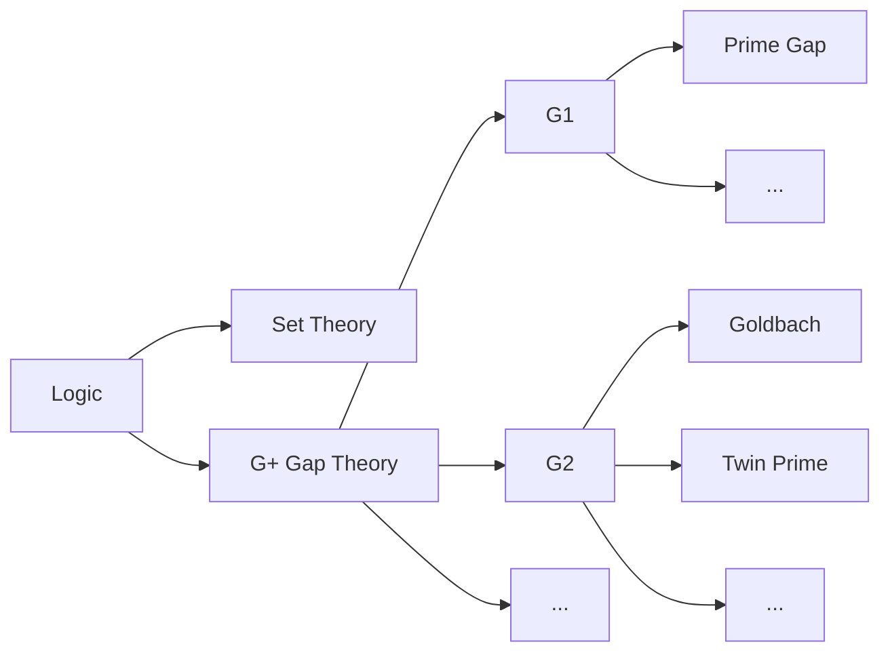

TITLE:《呼吁全社会关注民间数学工作成果和歧视》
# 呼吁全社会关注民间数学工作成果和歧视

(2027年06月17日created)
(2027年7月27日last edit)
（永久有效）
王钟

根据鄙视链，数学分三大界，依次为：婆罗门，朝廷学阀，中国民间。
洋大人有钱自娱自乐，自己设自己颁。
洋奖头一次给了中国籍，范进中举，全国争相追捧。
可是，中国民间，同样做出了更牛逼更伟大的理论，得不到任何关注。

我2001年给出的重大理论突破，重新解释统一了数论领域一大类目。

比如孪生素数和哥德巴赫等问题属于G2子类。
目前，数学界不再研究转去比如黎曼猜想或ABC猜想了。
可以说开创了一个新的理论体系。洋人的说法叫paradigm shift。
如果包含，那中国2002年有了。
如果解决一个猜想就给一个奖。
那国际数学家大会ICM变成私人要爆无穷多个奖出来。

证明庞加莱猜想格里戈里·佩雷尔曼不来领奖，有人说这哥们有病，我能理解。
话都不会跟你说，更别提奖给我的。
婆罗门极端歧视贱民。
算求跪下来求要我，我也会不要。

摆在官方面前两种选择，要么承认，要么打假。
官方选择无视，拒稿，不发表任何意见。
玩过狼人杀的都知道。
不管用什么理由回避，不说话，不打假，就是默认且没有异议。
不表态就是一种表态。

众所周知，西方偏见，种族歧视严重，始终存在，从来没有减轻过。
中国人内部还要搞分个，高低贵贱，三六九等。
民科是反民科对爱好者的侮辱代称，类似尼哥。
民科算是数学界最低种姓。

首先官方封了我投稿的邮箱，我没办法投稿。
在reddit的帖子吧主设置仅个人可见。
B站搜哥德巴赫猜想，点击任何页都返回第一页。
我发了英文视频说了这件事后，B站相对敏感立马改了。
博主《爸比说》他的视频锁定第一页第一个。
但问题是别人的视频都有，我的同样标题，在B站都搜不到。
博主《民科厌恶者》鹰犬级，专咬民科，常年在B站首页。

当年弄上来一个猪肘子，打科普旗号，打民科。
反民科在各种贴吧，辱骂攻击，把民科精神病的形象在全国媒体植入大众舆论意识。
《科妄》是最近出现在反民科圈口中造出新词。
精神正常的人很难把人格侮辱他人当事业坚持几十二十年。
成本这一块一般人就支付不起。
可以说，真的下血本在一手遮天。

哪怕有一处小错，反民科早把我撕把烂。
确实咬不动，那就只有下三路。
科普博主还是官方组织应该都知道我，都假装我不存在。
可以做到滴水不漏，一字不提，守口如瓶。
在贴吧知乎等地集体群嘲，含沙射影，指桑骂槐。
有知乎数学专业的，用匿名留言辱骂歧视，骂完消号。
扒黑料捅咕给洋人当笑料，段子比论文先人一步飞出国门。

我年轻时，2001年19岁，工资200，每天在KFC冲屎刷厕所。
喜欢找北大清华，中科院等能找到邮箱发。
婆罗门觉得我低贱，不屑于跟低种姓有任何联系。
歧视是系统性，大规模，有组织。
可以说明，婆罗门对底层劳动人民的恨是咬牙切齿，歧视深入骨髓。
在伪善的斯文败类眼里我不算中国人，也打算把我当人看。
在明知对国家和民族有重大贡献的情况下，刻意打压，瞒报。
奸臣当道。

有数学专业私信我承认的，但其它大部分看戏居多，读空气当日本人。
我人微言轻，青天有眼，善恶看承，社会脊梁出面为民请命，上达天庭。