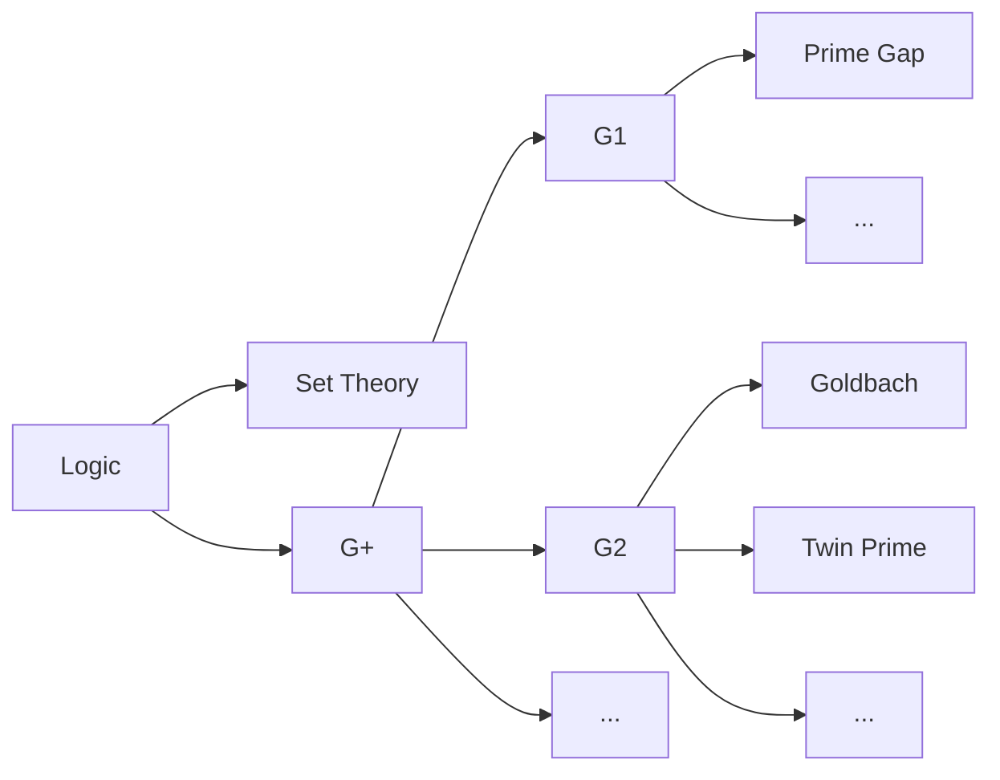

# 呼吁全球关注STEM爱好者重大学术成果，学术圈歧视和腐败，2026

(2026年06月17日created)
(2026年08月11日last edit)
（永久有效）
王钟

（内容真实，演绎脱敏，化名处理）

按种姓，数学界可分，西天婆罗门，东土大唐朝廷官科和民间个人爱好者。
2026年7月，西方大奖头一次下凡给了大唐的同志，可谓范进中举。
祖国和人民未曾可知，2001年，有幸无意间发现了一条定量定性分析规律。
多年演变为统一，重新解释数论的一般理论。
结束百年盲人摸象，开新体系。

譬如，twin prime和Goldbach同属于G2子类。
论文确实产生影响。
目前，数学界已转向比如黎曼、ABC等猜想。
没人再蠢到继续研究。
如果解决一个重大问题就给一枚金牌，那ICM当年就可以宣布破产倒闭了。
没有出圈，老百姓不知道的原因是圈层一直在歧视和打压。

2001下半年，第一时间，联系国内相关单位和期刊。
出生牛犊，人间险恶。
至今如黑洞，只进不出。
做出了重大成果，却得不到任何帮助。可谓，世态炎凉。
全凭9年义务教育走到今天。

人分三六九等。
歧视严重，上层对底层天生歧视憎恶。
在眼里贱民一生只配做牛做马。
为维持权威，面子利益，可以组织起系统歧视，手段堪比纳粹对犹太人。
把一是一二是二的理工科，搞得像邪教站队圈层斗争，类似打压大陆漂移学说和日心说。

比如：
联系数学相关单位或个人无人回应。
封邮箱，没法投核心期刊。
reddit的帖子被吧主设置为仅个人可见。
B站搜《哥德巴赫猜想》点击任何页都返回第一页。
《爸比说》的视频永远锁定第一页的第一个。
发一条英语视频立马改了。
但素人的视频有，按时间顺序搜任何视频都不出现。
说明有人盯着且相当敏感。

民科在反民科语境里是侮辱业余爱好者的称呼，类似尼小姐。
反民科常驻各种贴吧论坛当吧主，制造操纵媒体舆论，辱骂攻击。
通过各种媒体把民科精神病的形象植入大众意识。
有些民科是串子号。
只有养尊处优，专门整人为乐的小丑想得出来。
正常人很难把人格侮辱他人当事业坚持几十年。
《科妄》是最近反民科圈发明的新词，算析出仇恨的结晶。

在上层圈层阶级意识里，只有博士才能做出成果，有资格发顶刊，只有白人才配交流。
权贵和他们养的狗仇恨的纯粹是贱民，社会底层，初中学历，黄种人的身份。
天庭封野猴子齐天大圣，让仙界非常不体面。
数学核心圈层的态度是拒稿，打压，绝罚。
乃正经理论，归类为是民科，纯粹是狗眼看人低，出于种族色盲和种姓失明。
一方面，视民科蛆虫不如。
另方面，疯狂辱骂诋毁。
本身逻辑矛盾，反的也不是民科，而是借题发挥，指桑骂槐。
打假就是曝光，就是动五指山。
只玩下三路，含沙射影绝不指名道姓，最多匿名，骂完消号。
扒黑料报告给洋爹，段子先一步飞出国门，成数学圈内嘲笑暗梗。
反民科党，
一，打压舆论，二，阻止民众知情，三，挑拨离间制造矛盾，四，浑然不知全身而退。
这帮人的行为和结果，跟汉奸间谍无异，完美见习CIA《怎么搞垮组织》。

今天看到B站8月11日的视频《复旦留学生白人王水牛（化名）开后宫被百名女生侵犯不做防护逼打胎》。
据大卫哥的上个视频说还有个留子干了7000多人，更夸张。
相同年纪，2001年19岁在K记当服务员，平均一个月200每天不到8块。
上面经理怎么穿小鞋刁难，举个例子。
比如，擦大门玻璃扒了眼镜趴着检查哪怕一个针眼大小的唾沫星，就要重擦。
这是个生活常识，你可以随便找一家餐厅看看玻璃能不能一个点都没有。
达到天文望远镜纯洁级别，需要多少功夫。
这让想起在学校组织大扫除，小组长也是从老师那拿鸡毛当令箭。
有一天干了一半，停电，下班正好碰上她接班，停电时间不给工资。
本来工资没几块钱，而且也不是她出。
一直干冲屎刷厕所最脏最累的活。
这种工作干了两年，拿你当牲口使唤，两年不给升职。
这种人社会上很多，特别喜欢整人，比如，主持界张绍刚揪法国留学生衣领，科普打假的方舟子登上CCTV。

把别人对问题本质的探索当成精神病发作。
这些小丑可算抓住钻营机会。
西方白人多少要脸遮着点，中国人只骗中国人，一点不心慈手软（缅北KK电诈园区熟人杀猪盘，蓝战非绑架案）。
因为中国人听话，能吃苦，好欺负，不知反抗，甚至趋炎附势与老板串通一气。（2026香奈儿在意大利的劳工剥削调查）
近乎疯狂的病态偏执，见不得人好，多得一分钱。
你开心，它浑身刺挠，难受，晚上睡不着觉。
你痛苦倒霉，它开心到嘴角压不住，恨不得开香槟庆祝。

在最底层能品尝到每一种黑暗。
白对有色。
权贵精英对劳苦穷。
女性懒都懒得看的白眼。
工作就是996，无偿加班，拖欠不给工资。
排挤，孤立，精神变态，各种暴力霸凌，人生低贱到骨子里的绝望。

数学院所及科普博主不打假，也不敢出来表个态，非常诡异。
要么打假，要么出来支持，怎么还搞出个第三中间状态，无论怎样那也说明很有学术价值，你们在干什么chovy？
P个图改数据属于单个事件的积极学术不端。
假装看不见，该帮不帮，打压，长期集体噤声孤立霸凌，成体系有组织歧视，
消极学术腐败隐蔽危害更大。

这种圈地自萌，不把人当人的伪善缺德社会组织存在对人类有什么意义？
跟KTV内自娱自乐有什么区别？
俗话说，做事前先做人。
人都不做了，怎么做事，做事又何用？
视人为不可接触者的贱民，侮辱歧视，践踏人权法律。
在明知对国家和民族有贡献的情况下，装看不见，不提供任何帮助反而刻意打压。
敢问哪路神仙在背后提拔的汉奸，刚好出现在关键位置，长期漠视放任拉屎？
试问谁能维护华人的人权言论自由，政治权力，维护国际民族荣誉，平等？
人微言轻，希望得到有影响力的全球华人帮忙。
